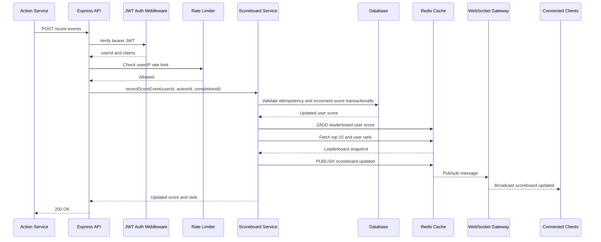
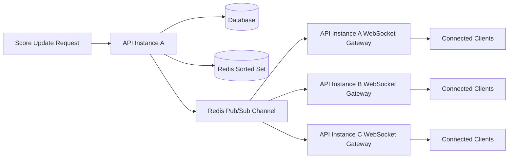

# Problem 6: Live Scoreboard API Specification

## Goal

Design a backend module that maintains a live top-10 scoreboard for a website. When an authenticated user completes an action, the action system calls this API service to increase that user's score. The service must persist the score change, refresh the cached leaderboard, and publish live updates to connected clients.

This specification focuses on backend structure and API design only. No frontend implementation is required.

## Requirements Coverage

| Requirement | Design decision |
| --- | --- |
| Show top 10 user scores | Store scores in the database and cache the leaderboard in Redis sorted sets. |
| Live scoreboard update | Use WebSocket as the primary realtime channel and HTTP polling as a fallback. |
| User action increases score | Accept a server-validated score event through `POST /score-events`. |
| Action dispatches API call | The action completion flow calls this module after the action is verified. |
| Prevent malicious score changes | Require JWT authentication, authorize event ownership, ignore client-provided totals, rate limit calls, and optionally enforce idempotency. |

## Backend Structure

| Area | Responsibility |
| --- | --- |
| Application bootstrap | Compose the Express app, shared middleware, HTTP server, and WebSocket server. |
| Scoreboard routes | Register `POST /score-events`, `GET /scoreboard/top`, `GET /scoreboard/me`, and `WS /scoreboard/live`. |
| Scoreboard controller | Adapt HTTP requests and WebSocket handshakes into service calls. |
| Scoreboard service | Coordinate score validation, idempotency, persistence, cache refresh, and realtime publish. |
| Scoreboard repository | Persist users, score totals, and score events in the durable database. |
| Redis leaderboard adapter | Maintain the sorted-set cache used for fast top-10 and rank reads. |
| Realtime gateway | Broadcast leaderboard updates through WebSocket and Redis pub/sub. |
| Middleware | Handle JWT authentication, request validation, and Redis-backed rate limiting. |

Layer responsibilities:

- `routes/controllers`: Own Express request mapping, validation, response codes, and DTO conversion.
- `service`: Own application rules, including score increment validation, idempotency, database update, cache update, and realtime publish.
- `repository`: Own durable score persistence. The database can be PostgreSQL, MySQL, MongoDB, or another production database.
- `redis-leaderboard`: Own fast top-10 reads, rank reads, and cache rebuild behavior.
- `realtime.gateway`: Own WebSocket clients and Redis pub/sub fanout across server instances.
- `middleware`: Own authentication, authorization context, and abuse protection.

## API Design

### `POST /score-events`

Records a completed action and increments the authenticated user's score.

Authentication: required JWT bearer token.

Request body fields:

| Field | Type | Required | Description |
| --- | --- | --- | --- |
| `actionId` | string | Yes | Server-known action identifier, such as a completed profile or check-in action. |
| `completionId` | string | Yes | Unique action-completion identifier used for idempotency. |

Notes:

- The request must not include the new total score.
- The service maps `actionId` to a server-owned score increment, for example `daily-check-in = 10`.
- `completionId` should be unique for the completed action and can be used as an idempotency key.
- If the same `completionId` is submitted again, return the already recorded result instead of increasing the score twice.

Success response fields:

| Field | Type | Description |
| --- | --- | --- |
| `userId` | string | Authenticated user whose score changed. |
| `score` | number | User's updated total score. |
| `rank` | number | User's current leaderboard rank. |
| `scoreAdded` | number | Server-calculated score increment applied for the action. |

Possible status codes:

| Status | Meaning |
| --- | --- |
| `200` | Score event accepted. |
| `400` | Invalid request body or unknown action. |
| `401` | Missing or invalid JWT. |
| `403` | Authenticated user is not allowed to submit this event. |
| `409` | Conflicting duplicate event with different payload. |
| `429` | Rate limit exceeded. |

### `GET /scoreboard/top?limit=10`

Returns the current leaderboard. This endpoint supports polling fallback when WebSocket is unavailable.

Authentication: optional or required depending on product policy. If the scoreboard is public, this can be unauthenticated but still rate limited.

Response fields:

| Field | Type | Description |
| --- | --- | --- |
| `items` | leaderboard item array | Top users ordered by score descending. |
| `items[].rank` | number | Rank position starting at `1`. |
| `items[].userId` | string | User identifier. |
| `items[].displayName` | string | Public display name, if available. |
| `items[].score` | number | Current total score. |
| `updatedAt` | ISO datetime string | Time the leaderboard response was generated. |

### `GET /scoreboard/me`

Returns the authenticated user's score and rank.

Authentication: required JWT bearer token.

Response fields:

| Field | Type | Description |
| --- | --- | --- |
| `userId` | string | Authenticated user id. |
| `score` | number | User's current total score. |
| `rank` | number | User's current leaderboard rank. |

### `WS /scoreboard/live`

Streams leaderboard updates to clients.

Authentication: JWT should be validated during the WebSocket handshake, either through an `Authorization` header or a short-lived connection token.

Message sent by server:

| Field | Type | Description |
| --- | --- | --- |
| `type` | string | Event type, expected to be `scoreboard.updated`. |
| `payload.items` | leaderboard item array | Updated top-10 leaderboard. |
| `payload.updatedAt` | ISO datetime string | Time the update was published. |

## Flow of Execution

Realtime fanout across multiple API instances:

## Cache Mechanism

Use Redis sorted sets for leaderboard reads:

- Key: `scoreboard:global`
- Member: `userId`
- Score: user's total score

Main operations:

- `ZADD scoreboard:global <score> <userId>` after a durable database update.
- `ZREVRANGE scoreboard:global 0 9 WITHSCORES` for top 10.
- `ZREVRANK scoreboard:global <userId>` for user rank.

Redis is a cache and realtime coordination layer, not the source of truth. The database remains authoritative. If Redis is unavailable, the service should still write the database update and either:

- read the top 10 from the database temporarily, or
- return the score update response and mark realtime publish for retry.

Cache rebuild strategy:

- On startup or cache miss, rebuild `scoreboard:global` from the database scores table.
- For large systems, rebuild asynchronously in batches.
- Add metrics for Redis failures, cache rebuild duration, and leaderboard read latency.

## Authentication and Authorization

Use JWT bearer authentication for score-changing endpoints.

Expected JWT claims:

| Claim | Required | Description |
| --- | --- | --- |
| `sub` | Yes | Authenticated user id. |
| `roles` | No | Authorization roles, for example `user` or `admin`. |
| `iat` | Yes | Issued-at timestamp. |
| `exp` | Yes | Expiration timestamp. |

Security rules:

- `sub` becomes the authenticated `userId`.
- The API must not accept `userId` from the request body for score updates.
- The score increment is determined by server-side action configuration, not by client input.
- JWT signature, issuer, audience, and expiration must be validated.
- Administrative score adjustment should be a separate endpoint with a stricter role, audit log, and different rate limit.

## Rate Limiting

Use Redis-backed rate limiting so limits work across multiple API instances.

Recommended limits:

- `POST /score-events`: per-user limit, for example `30 requests / minute`.
- `GET /scoreboard/top`: per-IP limit, for example `120 requests / minute`.
- WebSocket connection attempts: per-IP limit, for example `20 attempts / minute`.

## Data Model

Minimum durable records:

| Table | Fields | Purpose |
| --- | --- | --- |
| `users` | `id`, `display_name`, `score`, `created_at`, `updated_at` | Stores the current durable score for each user. |
| `score_events` | `id`, `user_id`, `action_id`, `completion_id`, `score_added`, `created_at` | Stores each accepted score-changing event for auditability and idempotency. |

Important database constraints:

- `users.id` is unique.
- `score_events.completion_id` is unique, or unique together with `user_id`.
- Score increment and event insert should happen in one transaction.
- The repository method should be named around behavior, for example `incrementScoreOnce`, to make idempotency explicit.

## Malicious User Prevention

The main risk is a user trying to increase their score without completing the real action. The backend should reduce this risk with several controls:

- Authenticate every score-changing request with JWT.
- Derive `userId` from the JWT, never from request body input.
- Use a server-owned `actionId -> scoreAdded` mapping.
- Verify that the action completion is valid. This can be done by receiving the event only from a trusted internal action service, or querying the action service before incrementing score.
- Use idempotency keys so replaying the same completion cannot add score twice.
- Apply per-user and per-IP rate limits.
- Audit score events with `userId`, `actionId`, `completionId`, request id, IP, and user agent.

## Improvements and Operational Notes

- Add OpenAPI documentation for the HTTP endpoints and AsyncAPI documentation for WebSocket messages.
- Add structured logs and metrics for accepted events, rejected events, leaderboard latency, Redis errors, and WebSocket client count.
- Add a background reconciliation job that compares database scores against Redis sorted-set values and repairs drift.
- Add graceful degradation: if WebSocket is unavailable, clients can poll `GET /scoreboard/top?limit=10`.
